<h1 align="center">Hi 👋, I'm Kartik Kashyap</h1>
<h3 align="center">
Creative Technologist · AI × Society × Forensics · B.Tech IT
</h3>

I build <b>research-driven systems</b> where <b>code meets courts</b>,  
<b>data meets human behavior</b>, and <b>AI stays accountable</b>.

---

## 🧠 What I Work On

I explore how **technology shapes human behavior, justice systems, and society** —  
and how we can design systems that are **ethical, explainable, and usable in the real world**.

**Core themes I work at:**
- AI for **forensics, law & investigations**
- **Crime data analytics & GIS mapping**
- Human-centered **evidence integrity systems**
- Bias, polarization & algorithmic behavior
- Educational simulators for complex human systems

---

## 🔬 Research Interests

I’m deeply interested in exploring how **technology interacts with human cognition, institutions, and society**, especially in high-stakes domains like law, security, and governance.

**Primary interests include:**
- Explainable & accountable AI for **forensics, investigations, and courts**
- Algorithmic bias, polarization & decision-making in socio-technical systems
- Crime analytics, GIS-based criminology & public safety data systems
- Human-centered evidence management & chain-of-custody architectures
- Educational simulations for complex human systems (law, psychology, society)
- AI interfaces for reasoning, not just prediction

**Long-term goal:**  
To build systems that help humans *reason better*, not just *decide faster*.

---

## 🧪 Flagship Work & Research Repositories

### 🧠⚖️ Forensics, Criminology & Human-Centered Tech Lab
🔗 https://github.com/Kartik-Kashyap/forensics-criminology-tech-lab

**What lives here:**
- 🧾 Chain-of-custody & evidence integrity simulations  
- 🧠 AI-assisted forensic reasoning & bias detection  
- 🗺️ QGIS-based crime mapping & NCRB analytics (10k+ datapoints) 
- 🤖 Local LLMs for explainable forensic narratives  
- 📊 Investigator vs public-facing dashboards  

> Focus: *Court-admissible, ethical, explainable systems — not black-box AI.*

---

### 🌏 SAARC Internship – AI & Digital Citizenship
🔗 https://github.com/Kartik-Kashyap/SAARC-internship-research-work

**Systems built during internship at SAARC Secretariat (Kathmandu):**
- Echo Chamber & Polarization Simulator  
- AI-Driven Social Media Feed Simulator (LLaMA 3.2)  
- SAARC-focused AI Assistant  
- South Asian Youth Digital Landscape Dashboard  

📊 Analyzed **10,000+ data points across 8 South Asian countries**  
🧠 Studied algorithmic polarization, youth participation & platform behavior

---

## 🧩 Selected Systems I’ve Built

- **P-FEICS v2.0** — Psycho-Forensic Evidence Integrity & Chain-of-Custody Platform  
  *(AES-256-GCM, hash-chained logs, watermarking, examiner authentication)*

- **Forensic Reasoning Training System**  
  *(Bias detection, FIR structuring, hypothesis mapping, decision simulations)*

- **Crime Prediction & Hotspot Simulator**  
  *(10+ years NCRB data, population-adjusted models, ~82% accuracy)*

- **Smart Surveillance Pipelines**  
  *(Face & gait recognition, anomaly detection, post-incident tracing)*

- **Educational & Conceptual Simulators**  
  *(Game Theory tournaments, chaos systems, Fold-and-Cut theorem, Game of Life)*

---

## 🛠 Tech Stack (Reality-Driven, Not Buzzword-Driven)

**Languages**

Python · C · C++ · JavaScript · Shell · HTML · CSS

**AI / ML**

Computer Vision · Anomaly Detection · Predictive Modeling · Explainable AI

**Forensics & Security**

Digital Evidence Systems · Chain-of-Custody · Cryptography · Watermarking

**Data & Visualization**

NCRB Data · QGIS · Pandas · NumPy · Matplotlib · Dash · Manim

**Systems & Tools**

Linux · Git · IoT · Node.js · MySQL · Obsidian

---

## 💻 Tech Stack

### 🧑‍💻 Languages

### 🤖 AI / ML / Data

### 🗺️ GIS & Visualization

### 🔐 Security & Systems

### 🌐 Web & Tooling

---

## 📊 GitHub Activity Snapshot

---

## 🧭 How I Think About Tech

> I don’t build apps just to ship features.  
> I build **systems that explain themselves**,  
> **respect human complexity**,  
> and **survive contact with reality** — courts, policy, society, and people.

If you’re working on:
- AI + law / policy  
- forensic or investigative systems
- psychology, sociology, or anything related to human behavior
- human-centered AI  
- serious simulations & educational tech  

…I’d genuinely love to collaborate.

---

  <i>“Technology doesn’t just solve problems — it reveals how we think.”</i>

